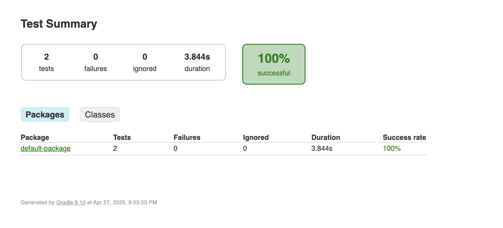

# Matching Engine Website Automation Test

This project automates UI testing for the MatchingEngine.com website using:

- **Kotlin**
- **Selenium WebDriver**
- **TestNG**
- **WebDriverManager**

## Prerequisites
- Java 17+
- Gradle (or use the included wrapper `./gradlew`)
- Chrome browser installed

## How to Run Locally without Docker

1. Clone this repository:
    ```bash
    git clone https://github.com/SaiPrathimaDS/matchingengine_test.git 
    cd matching-engine-test
    ```
2. Install dependencies:
    ```bash
    export JAVA_OPTS=-Dwebdriver.chrome.driver=/path/to/chromedriver
    ./gradlew build
    ```
3. Run tests:
    ```bash
    ./gradlew test
    ```
4. View test reports:
    After the tests complete, view the test report at:
    ```
    build/reports/tests/test/index.html
    ```
5. Verify network configuration:
    Ensure the machine has network access to any external URLs used in the tests (e.g., https://www.matchingengine.com).

## How to Run Locally with Docker (Optional)

1. Ensure Prerequisites Are Installed:  
   Install Docker and Docker Compose on the target machine.

2. Clone the Repository:
    ```bash
    git clone https://github.com/SaiPrathimaDS/matchingengine_test.git 
    cd matchingengine_test
    ```
3. Build and Run Using Docker:
    1. Build the Docker image:
       ```bash
       docker-compose build
       ```
    2. Run the tests using Docker Compose:
       ```bash
       docker-compose up
       ```
    3. View test reports:
       After the tests complete, view the test report at:
       ```
       build/reports/tests/test/index.html
       ```
    4. Verify network configuration:
       Ensure the machine has network access to any external URLs used in the tests (e.g., https://www.matchingengine.com).
    5. Clean up:
       ```bash
       docker-compose down
       ```

## Reporting

The project uses **TestNG** for reporting.  
TestNG generates an HTML report after the test execution. You can find the report in the `build/reports/tests/test` directory.  
The report includes detailed information about the test execution, including passed and failed tests, execution time, and more.


## Results Snapshots



